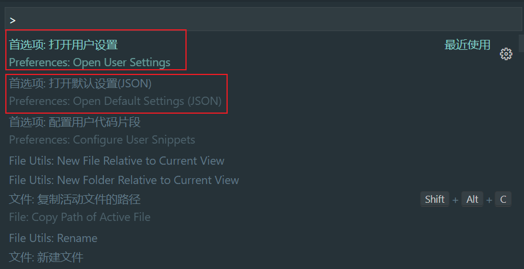

# 支持 tsx

需要 vite 官方插件[@vitejs/plugin-vue-jsx](https://github.com/vitejs/vite/tree/main/packages/plugin-vue-jsx)，跟着文档走就好了。这个插件基于[@vue/babel-plugin-jsx](https://github.com/vuejs/babel-plugin-jsx)，所以传入的选项需要参考

```sh
pnpm add @vitejs/plugin-vue-jsx -D
```

```ts
// vite.config.ts
import vueJsx from '@vitejs/plugin-vue-jsx'

export default {
  plugins: [
    vueJsx({
      // options are passed on to @vue/babel-plugin-jsx
    }),
  ],
}
```

在`main.ts`里引入`App.tsx`代替`App.vue`，这里`.tsx`后缀名可以省略。

```tsx
// App.tsx
import { defineComponent } from 'vue'

export default defineComponent({
  setup() {
    return () => <div>hello world</div>
  },
})
```

# types

新建`src/types`文件夹，这里用来管理我们的全局声明文件。

首先把`env.d.ts`移动到这个文件夹内，这个文件夹是 vite 自带的`.vue`文件的模块扩展声明文件，我们如果所有代码都用 tsx 写的话，这个文件其实可以不用了。

再新建`index.d.ts`，这里我们声明一些全局的类型，全局声明的类型可以在整个项目的任何地方使用，而不用导入。需要注意，**全局声明文件不能包含`import`和`export`，否则就不是全局声明文件了**。

```ts
// src/types/index.d.ts
type Id = number | string
type NullableId = Id | null
```

```ts
// App.tsx
const id: Id = 1 // 不需要import Id这个类型，可以直接用
```

# vite 配置路径别名

```ts
// vite.config.ts
import path from 'path'

const resolve = (dir: string) => path.resolve(__dirname, '.', dir)

export default defineConfig({
  resolve: {
    alias: {
      '@': resolve('src'),
    },
  },
})
```

上面的代码会报错，首先`path`是 node 模块，需要安装 node 的类型：

```sh
pnpm add @types/node -D
```

然后需要在`tsconfig.node.json`里把`compilerOptions.allowSyntheticDefaultImports`字段设置为 true（没有这个字段需要自己加上），因为`path`模块里是没有默认导出的。我这里用的 vite 版本是 2.9.9，以前用 vite 启动的时候是没有`tsconfig.node.json`的，不知道从哪个版本开始改的，以前的配置是不一样的，这个需要注意一下。

# 集成 eslint

## 依赖

```sh
pnpm add eslint eslint-plugin-vue @typescript-eslint/parser @typescript-eslint/eslint-plugin -D
```

这里逐一介绍下上面这些依赖的作用：

- eslint: 这个不用说，eslint 的核心代码
- eslint-plugin-vue: eslint 插件，里面是 eslint 关于 vue 的一些规则
- @typescript-eslint/parser: 指定 eslint 的解析器（默认是 Espree）
- @typescript-eslint/eslint-plugin: eslint 插件，里面是 eslint 关于 ts 的一些规则

## 配置文件

然后通过命令行初始化 eslint 配置文件，这样会自动创建一个`.eslintrc.js`文件：

```sh
node_modules/.bin/eslint --init
```


此时配置文件是这样的：

```js
// .eslintrc.js
module.exports = {
  env: {
    browser: true,
    es2021: true,
    node: true,
  },
  extends: ['eslint:recommended', 'plugin:vue/essential', 'plugin:@typescript-eslint/recommended'],
  parser: 'vue-eslint-parser',
  parserOptions: {
    ecmaVersion: 'latest',
    parser: '@typescript-eslint/parser',
    sourceType: 'module',
  },
  plugins: ['vue', '@typescript-eslint'],
  rules: {},
}
```

其中`"plugin:vue/essential"`是 vue2 的规则集，我们需要改成 vue3 的：`"plugin:vue/vue3-recommended"`

在 package.json 添加两行命令：

```json
// package.json
"lint": "eslint --ext .ts,.tsx,.vue src/",
"lint:fix": "eslint --ext .ts,.tsx,.vue --fix src/"
```

运行`pnpm lint`发现报错：


这是因为我们把`parserOptions.parser`设置成了`@typescript-eslint/parser`，这个解析器不认识 vue 文件，我们在`.eslintrc.js`文件中加一行`"parser": "vue-eslint-parser"`，这样 vue 文件就能使用`vue-eslint-parser`这个解析器了。

```js
// .eslintrc.js
"parser": "vue-eslint-parser",
"parserOptions": {
  "parser": "@typescript-eslint/parser",
},
```

如果 vue 文件里使用了 script setup 写法，并且使用了`withDefaults`,`defineProps`,`defineEmits`和`defineExpose`这些编译器宏，也会触发 eslint 报错，因为这些没有 import 进来，eslint 不认识：


eslint-plugin-vue 的 env 中内置了对编译器宏的支持，我们开启就好了：

```js
// .eslintrc.js
"env": {
  "vue/setup-compiler-macros": true
}
```

## 集成 vscode-eslint 插件

我们在开发过程中如果写一段代码就命令行 lint 校验一下，开发体验很不好。我们可以通过 vscode 的 eslint 插件，在我们保存代码时自动帮我们校验当前变动的文件，并且还能尽量修复可修复的代码。

首先在 vscode 中安装 eslint 插件，同时新建`.vscode/settings.json`文件：

```json
// .vscode/setttings.json
{
  "editor.codeActionsOnSave": {
    "source.fixAll.eslint": true
  }
}
```

这样在 vscode 中按下`ctrl + s`保存代码时，vscode 的 eslint 插件就会自动帮我们应用 eslint 校验规则，并且可以帮我们自动修复部分可以被修复的代码。比如，我们在`main.ts`里输入下面这行代码：

```ts
// main.ts
var a = 1
```

eslint 的`no-var`不允许我们使用`var`来声明变量，所以当我们保存代码时，vscode 的 eslint 插件就会自动帮我们把`var`修复为`const`。

# 集成 prettier

```sh
pnpm add prettier eslint-config-prettier eslint-plugin-prettier -D
```

这里同样解释下上面这些依赖的作用，`prettier`是核心库，`eslint-config-prettier`和`eslint-plugin-prettier`是用来解决 eslint 和 prettier 的冲突的。

根目录下新建`.prettierrc.js`

然后修改`.eslintrc.js`，新增如下配置：

```js
// .eslintrc.js
"extends": [
  "prettier",
  "plugin:prettier/recommended"
],
"plugins": [
  "prettier"
],
```

同时在`package.json`中加入两行命令：

```json
"scripts": {
  "prettier": "prettier --check ./src/**/*.{vue,ts,tsx,js,jsx}",
  "prettier:fix": "prettier --write ./src/**/*.{vue,ts,tsx,js,jsx}"
}
```

上面第一行命令仅检查格式并在终端中提示错误，第二行会把检查到的不正确的代码格式自动原地修复。

## 集成vscode-prettier插件

和eslint一样，我们同样可以利用vscode的prettier插件完成在保存代码时自动进行代码格式化的目的。

首先安装插件，然后在`.vscode/settings.json`中增加配置：

```json
// .vscode/settings.json
"editor.formatOnSave": true,
"editor.defaultFormatter": "esbenp.prettier-vscode"
```

上面第一行设置会让vscode在代码保存时自动格式化代码，第二行设置指定默认的格式化工具为prettier。

这里有个坑，上面第二行设置只是为所有文件设置了默认格式化工具，但是这个设置是会被更细粒度的语言级别的设置覆盖的。比如我以前在用户设置中设置了vue文件的代码格式化工具为vetur，所以我在保存我的vue文件的时候并没有使用prettier来格式化，而是依然使用了vetur。要解决这个问题，最好是在工作区设置中把所有可能用到的语言的格式化工具都指定一遍，因为你不能提前知道团队中其它开发者是否在用户设置中把某个语言设置了其它的格式化工具：

```json
// .vscode/settins.json
"[javascript]": {
  "editor.defaultFormatter": "esbenp.prettier-vscode"
},
"[javascriptreact]": {
  "editor.defaultFormatter": "esbenp.prettier-vscode"
},
"[typescript]": {
  "editor.defaultFormatter": "esbenp.prettier-vscode"
},
"[typescriptreact]": {
  "editor.defaultFormatter": "esbenp.prettier-vscode"
},
"[html]": {
  "editor.defaultFormatter": "esbenp.prettier-vscode"
},
"[css]": {
  "editor.defaultFormatter": "esbenp.prettier-vscode"
},
"[less]": {
  "editor.defaultFormatter": "esbenp.prettier-vscode"
},
"[scss]": {
  "editor.defaultFormatter": "esbenp.prettier-vscode"
},
"[markdown]": {
  "editor.defaultFormatter": "esbenp.prettier-vscode"
},
"[vue]": {
  "editor.defaultFormatter": "esbenp.prettier-vscode"
},
"[json]": {
  "editor.defaultFormatter": "esbenp.prettier-vscode"
},
"[jsonc]": {
  "editor.defaultFormatter": "esbenp.prettier-vscode"
},
},
```

上面提到了vscode的用户设置，就顺带提一句，vscode总共有三种设置，按照优先级从大大小排列分别是：**工作区设置**、**用户设置**和**默认设置**。

用户设置和默认设置可以通过`ctrl + shift + p`命令呼出：



默认设置是vscode为我们预定义的设置。用户设置会覆盖默认设置并应用到所有工作区。工作区设置会覆盖默认设置和用户设置，同时只影响当前工作区，工作区设置我们前面已经接触过了，就是在项目根目录下的`.vscode/settings.json`。


