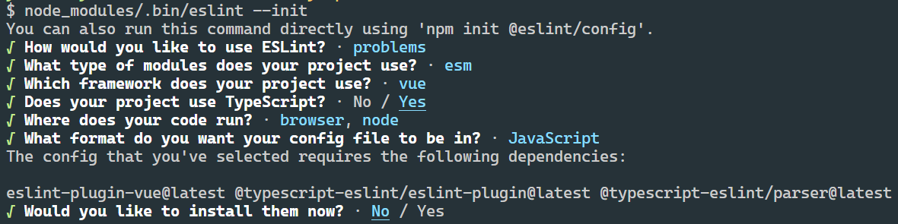
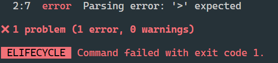
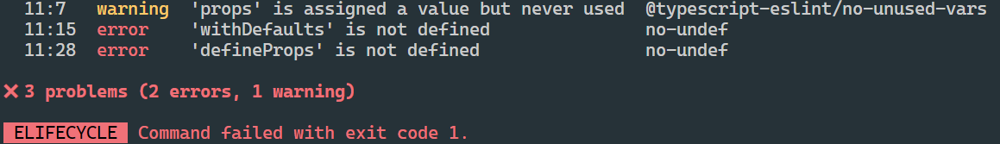

# 支持tsx

需要vite官方插件[@vitejs/plugin-vue-jsx](https://github.com/vitejs/vite/tree/main/packages/plugin-vue-jsx)，跟着文档走就好了。这个插件基于[@vue/babel-plugin-jsx](https://github.com/vuejs/babel-plugin-jsx)，所以传入的选项需要参考

```sh
pnpm add @vitejs/plugin-vue-jsx -D
```

```ts
// vite.config.ts
import vueJsx from '@vitejs/plugin-vue-jsx'

export default {
  plugins: [
    vueJsx({
      // options are passed on to @vue/babel-plugin-jsx
    })
  ]
}
```

在`main.ts`里引入`App.tsx`代替`App.vue`，这里`.tsx`后缀名可以省略。

```tsx
// App.tsx
import { defineComponent } from 'vue'

export default defineComponent({
  setup() {
    return () => <div>hello world</div>
  }
})
```

# types

新建`src/types`文件夹，这里用来管理我们的全局声明文件。

首先把`env.d.ts`移动到这个文件夹内，这个文件夹是vite自带的`.vue`文件的模块扩展声明文件，我们如果所有代码都用tsx写的话，这个文件其实可以不用了。

再新建`index.d.ts`，这里我们声明一些全局的类型，全局声明的类型可以在整个项目的任何地方使用，而不用导入。需要注意，**全局声明文件不能包含`import`和`export`，否则就不是全局声明文件了**。

```ts
// src/types/index.d.ts
type Id = number | string
type NullableId = Id | null
```

```ts
// App.tsx
const id: Id = 1 // 不需要import Id这个类型，可以直接用
```

# vite配置路径别名

```ts
// vite.config.ts
import path from 'path'

const resolve = (dir: string) => path.resolve(__dirname, '.', dir)

export default defineConfig({
  resolve: {
    alias: {
      '@': resolve('src')
    }
  }
})
```

上面的代码会报错，首先`path`是node模块，需要安装node的类型：

```sh
pnpm add @types/node -D
```

然后需要在`tsconfig.node.json`里把`compilerOptions.allowSyntheticDefaultImports`字段设置为true（没有这个字段需要自己加上），因为`path`模块里是没有默认导出的。我这里用的vite版本是2.9.9，以前用vite启动的时候是没有`tsconfig.node.json`的，不知道从哪个版本开始改的，以前的配置是不一样的，这个需要注意一下。

# 配置eslint

## 依赖

```sh
pnpm add eslint eslint-plugin-vue @typescript-eslint/parser @typescript-eslint/eslint-plugin -D
```

这里逐一介绍下上面这些依赖的作用：

- eslint: 这个不用说，eslint的核心代码
- eslint-plugin-vue: eslint插件，里面是eslint关于vue的一些规则
- @typescript-eslint/parser: 指定eslint的解析器（默认是Espree）
- @typescript-eslint/eslint-plugin: eslint插件，里面是eslint关于ts的一些规则

## 配置文件

然后通过命令行初始化eslint配置文件，这样会自动创建一个`.eslintrc.js`文件：

```sh
node_modules/.bin/eslint --init
```



此时配置文件是这样的：

```js
// .eslintrc.js
module.exports = {
  "env": {
    "browser": true,
    "es2021": true,
    "node": true
  },
  "extends": [
    "eslint:recommended",
    "plugin:vue/essential",
    "plugin:@typescript-eslint/recommended"
  ],
  "parser": "vue-eslint-parser",
  "parserOptions": {
    "ecmaVersion": "latest",
    "parser": "@typescript-eslint/parser",
    "sourceType": "module"
  },
  "plugins": [
    "vue",
    "@typescript-eslint"
  ],
  "rules": {}
}
```

其中`"plugin:vue/essential"`是vue2的规则集，我们需要改成vue3的：`"plugin:vue/vue3-recommended"`

在package.json添加两行命令：

```json
// package.json
"lint": "eslint --ext .ts,.tsx,.vue src/",
"lint:fix": "eslint --ext .ts,.tsx,.vue --fix src/"
```

运行`pnpm lint`发现报错：



这是因为我们把`parserOptions.parser`设置成了`@typescript-eslint/parser`，这个解析器不认识vue文件，我们在`.eslintrc.js`文件中加一行`"parser": "vue-eslint-parser"`，这样vue文件就能使用`vue-eslint-parser`这个解析器了。

```js
// .eslintrc.js
"parser": "vue-eslint-parser",
"parserOptions": {
  "parser": "@typescript-eslint/parser",
},
```

如果vue文件里使用了script setup写法，并且使用了`withDefaults`,`defineProps`,`defineEmits`和`defineExpose`这些编译器宏，也会触发eslint报错，因为这些没有import进来，eslint不认识：



eslint-plugin-vue的env中内置了对编译器宏的支持，我们开启就好了：

```js
// .eslintrc.js
"env": {
  "vue/setup-compiler-macros": true
}
```

## 集成vscode-eslint插件

我们在开发过程中如果写一段代码就命令行lint校验一下，开发体验很不好。我们可以通过vscode的eslint插件，在我们保存代码时自动帮我们校验当前变动的文件，并且还能尽量修复可修复的代码。

首先在vscode中安装eslint插件，同时新建`.vscode/settings.json`文件：

```json
// .vscode/setttings.json
{
  "editor.codeActionsOnSave": {
    "source.fixAll.eslint": true
  }
}
```

这样在vscode中按下`ctrl + s`保存代码时，vscode的eslint插件就会自动帮我们应用eslint校验规则，并且可以帮我们自动修复部分可以被修复的代码。比如，我们在`main.ts`里输入下面这行代码：

```ts
// main.ts
var a = 1
```

eslint的`no-var`不允许我们使用`var`来声明变量，所以当我们保存代码时，vscode的eslint插件就会自动帮我们把`var`修复为`const`。
